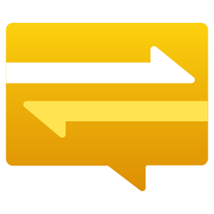

<p align="center"><a href="https://azure.microsoft.com/en-us/services/notification-hubs/"></a></p>

# Azure Notification Hubs - Android SDK
[](https://bintray.com/microsoftazuremobile/SDK/Notification-Hubs-Android-SDK/_latestVersion)

Azure Notification Hubs (ANH) provides a multi-platform, scaled-out push infrastructure that enables you to send mobile push notifications from any backend (in the cloud or on-premises) to any mobile platform. To learn more, visit our [Developer Center](https://azure.microsoft.com/en-us/documentation/services/notification-hubs).

## Getting Started with ANH Android SDK

To use ANH in your Android application, you'll need to accomplish a few things:

1. Ensure your application is registered with Firebase.
1. Add a reference to this library in your `build.gradle`.
1. Add your hub's credentials to your application.

Below is a quick overview of these steps, for a more complete tutorial see our [FCM tutorials](https://docs.microsoft.com/en-us/azure/notification-hubs/android-sdk).

### Register with Firebase

One of the primary goals of ANH is to provide an abstraction over platform specific notification delivery services, it is not an alternative. In order to make sure your application is set up to receive push notifications from Firebase, follow steps 1 through 3 in [this Firebase set up tutorial](https://firebase.google.com/docs/android/setup#console).

Once you have a Firebase project, and your application registered, make sure to configure the API Key in your Notification Hub. Instructions can be found [here](https://docs.microsoft.com/en-us/azure/notification-hubs/configure-notification-hub-portal-pns-settings?tabs=azure-portal#google-firebase-cloud-messaging-fcm).

### Reference with Gradle

There are two SKUs of this library published on [Bintray](https://bintray.com/microsoftazuremobile/SDK/):

- _General:_ [notification-hubs-android-sdk](https://bintray.com/beta/#/microsoftazuremobile/SDK/Notification-Hubs-Android-SDK?tab=overview)
- _FCM Optimized:_ [notification-hubs-android-sdk-fcm](https://bintray.com/beta/#/microsoftazuremobile/SDK/Notification-Hubs-Android-SDK-fcm?tab=overview).

Adding a reference to either project is as simple as editting two files in your project:

_{project-root}/build.gradle:_

``` groovy
// This is not a complete build.gradle file, it only highlights the portions you'll need to use ANH.

allprojects {
    repositories {
        // Ensure you have the following repsoitory in your "allprojects", "repositories" section.
        maven {
            url 'https://dl.bintray.com/microsoftazuremobile/SDK'
        }
    }
}
```

_{project-root}/{your-module}/build.gradle:_

``` groovy
// This is not a complete build.gradle file, it only highlights the portions you'll need to use ANH.

dependencies {
    // Ensure the following line is included in your app/library's "dependencies" section.
    implementation 'com.microsoft.azure:notification-hubs-android-sdk:1.1.3'
    // optionally, use the fcm optimized SKU instead:
    // implementation 'com.microsoft.azure:notification-hubs-android-sdk-fcm:1.1.3'
}
```

### Embedding Hub Credentials

In order to connect to your Notification Hub, you'll need to embed the key from an access signature into your application. Remember, **client applications should always use the Listen only access signature**. Step six in [this section](https://docs.microsoft.com/en-us/azure/notification-hubs/android-sdk#configure-a-notification-hub) shows you how to fetch the access signature from the Azure portal.

The easiest way to embed your ANH credentials without commiting them to source control is to use BuildConfig to convert environment variables into a runtime field:

_{project-root}/{your-module}/build.gradle:_

``` groovy
// This is not a complete build.gradle file, it only highlights the portions you'll need to use ANH.

android {
    defaultConfig {
        // Populates BuildConfig.hubName with the value that was stored APP_HUB_NAME at build time.
        buildConfigField("String", "hubName", "\"${System.getenv('APP_HUB_NAME') ?: secretsProperties['APP_HUB_NAME']}\"")
        //Populates BuildConfig.hubListenConnectionString with the value that was stored in APP_NH_CONNECTION_STRING at build time.
        buildConfigField("String", "hubListenConnectionString", "\"${System.getenv('APP_NH_CONNECTION_STRING') ?: secretsProperties['APP_NH_CONNECTION_STRING']}\"")
    }
}
```

This will enable you to use the following line to initialize the library:

_MainActivity.java:_

``` java
NotificationHub.start(this.getApplication(), BuildConfig.hubName, BuildConfig.hubListenConnectionString);
```

## Cookbook

There's some functionality that we believe a lot of our users will want, but everybody will need tweak
or customize for their own needs. Our solution? Canned classes that you can copy/paste into your
applications.

| Recipe | Platform | Languages |
| :----: | :------: | :-------: |
| Device Properties | N/A | [Java](./notification-hubs-sample-app-java/src/main/java/com/example/notification_hubs_sample_app_java/cookbook/DevicePropertyProvider.java), [Kotlin](./notification-hubs-sample-app-kotlin/src/main/java/com/example/notification_hubs_sample_app_kotlin/cookbook/DevicePropertyProvider.kt) |
| NotificationDisplayer | Firebase | [Java](./notification-hubs-sample-app-java/src/fcm/java/com/example/notification_hubs_sample_app_java/cookbook/NotificationDisplayer.java) |

## Repository Contents

### [`com.microsoft.windowsazure.messaging.notificationhubs`](./notification-hubs-sdk/src/main/java/com/microsoft/windowsazure/messaging/notificationhubs)

The code found in this namespace uses ANH's [Installation flow](https://docs.microsoft.com/en-us/azure/notification-hubs/notification-hubs-push-notification-registration-management#installations). It is heavily influenced by App Center Push's SDK. It was designed to do more than just act as a REST client, instead abstracting away your interactions with ANH. New projects that are looking to use ANH should use the constructs found in this namespace.

Some highlights of the functionality provided in this namespace:

- With one line of initialization code, this library will automatically and asynchronously call the Notification Hub backend anytime device details change.
- Easily register a callback to receive Firebase Cloud Messaging notifications.
- Highly customizable pipeline to ensure your device always has the properties
you find most useful.

### [`com.microsoft.windowsazure.messaging`](./notification-hubs-sdk/src/main/java/com/microsoft/windowsazure/messaging)

This is our SDK's legacy codebase. It facilitates interactions with our [Registration flow](https://docs.microsoft.com/en-us/azure/notification-hubs/notification-hubs-push-notification-registration-management#registrations). This namespace contains code that does little more than act as a REST client. Customers newly using ANH should NOT use the code found in this namespace. Expect it to be deprecated.

### [`notification-hubs-sample-app-java`](./notification-hubs-sample-app-java)

This is a sample application built on `com.microsoft.windowsazure.messaging.notificationhubs`. It was built to represent current best practices, and
demonstrate how to get off the ground with ANH. If you're looking to experiment
with ANH, this is a good app to get started with, to see what it can do.

### [`notification-hubs-sample-app-legacy`](./notification-hubs-sample-app-legacy)

This application demonstrates how to use the Registration flow using `com.microsoft.windowsazure.messaging`. If older tutorials or blogs (published before August, 2020) don't otherwise specify, this is likely the sample application they are referring to.

### [`FCMTutorialApp`](./FCMTutorialApp)

This application demostrates the final product of a person freshly completing [this tutorial](https://docs.microsoft.com/en-us/azure/notification-hubs/notification-hubs-android-push-notification-google-fcm-get-started). When there is a discrepancy between the tutorial and this application, try running the application here to see if it has the desired behavior.

### [`notification-hubs-sdk-e2etestapp`](./notification-hubs-sdk-e2etestapp)

This is an old-school test harness to execute unit tests on `com.microsoft.windowsazure.messaging` from before there was a more sophististicated environment for executing tests in an Android environment.

## Contributing

This project welcomes contributions and suggestions.  Most contributions require you to agree to a
Contributor License Agreement (CLA) declaring that you have the right to, and actually do, grant us
the rights to use your contribution. For details, visit https://cla.microsoft.com.

When you submit a pull request, a CLA-bot will automatically determine whether you need to provide
a CLA and decorate the PR appropriately (e.g., label, comment). Simply follow the instructions
provided by the bot. You will only need to do this once across all repos using our CLA.

This project has adopted the [Microsoft Open Source Code of Conduct](https://opensource.microsoft.com/codeofconduct/).
For more information see the [Code of Conduct FAQ](https://opensource.microsoft.com/codeofconduct/faq/) or
contact [opencode@microsoft.com](mailto:opencode@microsoft.com) with any additional questions or comments.

